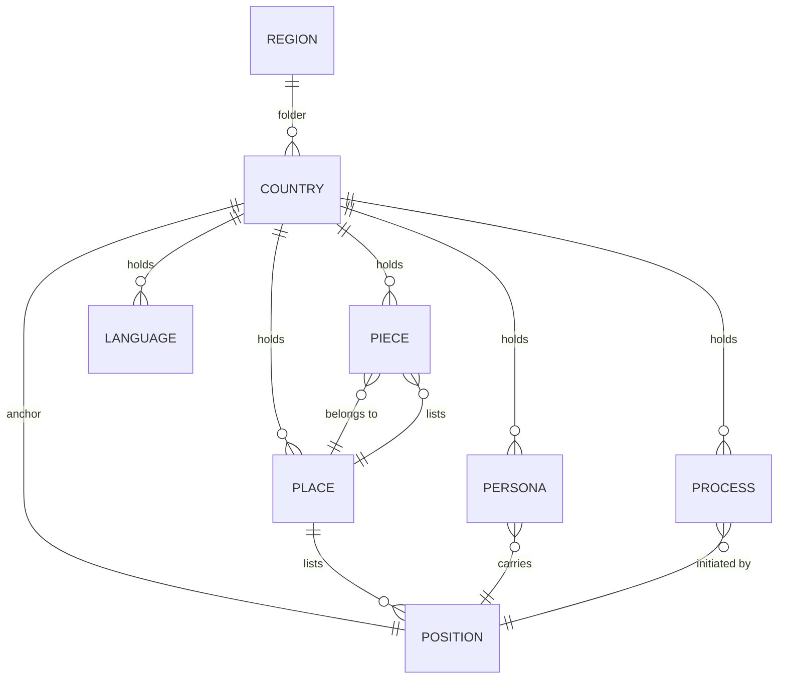

# ARCHITECTURE.md

*Cultures world architecture.*

**Concept:** Built on KAI HACKS AI Architecture and KAIWorlds framework.

**Project Scope:** All content files in `regions/` tree must conform to these rules.

---

## Global File Standards

These rules apply to **all** content files (`.md`) in the repository:

### Encoding

- **Character set:** UTF-8 only
- **Byte-order mark:** Forbidden (UTF-8 no BOM)

### Line Endings

- **Standard:** POSIX LF (`\n`) only
- **Forbidden:** Windows CRLF (`\r\n`)
- **Enforcement:** Git `.gitattributes` normalizes on commit; pre-commit hook strips CRLF on stage

### Trailing Newline

- **Required:** Every file must end with exactly one trailing newline (`\n`)
- **Rationale:** POSIX standard; prevents Git diffs showing "\ No newline at end of file"

### Footer

Every content file ends with two footer lines:

```
*Hofstede signal: this file contributes to the culture's aggregate score. Declared dimensions live in [README.md](README.md).*

v0.1.0 - KAI Worlds
```

- **Hofstede signal line:** Identifies the file as a contributor to the culture's aggregate Hofstede signal. Declared per-country scores live in the country `README.md`, never inline. The leading token `Hofstede signal:` is a stable sentinel for validators.
- **Version line:** `vX.Y.Z - KAI Worlds` where X.Y.Z matches repo version
- **Placement:** Hofstede signal line first, then the version line as the final line of file
- **Required in:** All `culture_*.md` files (positions, pieces, places, personas, languages, processes)
- **Forbidden:** Per-file Hofstede score lines (e.g. `**Hofstede:** PDI 35 · IDV 67 ...`). Scoring is aggregate, not per-file.

### Filenames

ASCII only. Underscores separate words. No hyphens or diacritics. Every basename unique.

Patterns:
- `regions/<region>/<country>/culture_<adj>_position.md`
- `regions/<region>/<country>/culture_<adj>_piece_<descriptor>.md`
- `regions/<region>/<country>/culture_<adj>_place_<descriptor>.md`
- `regions/<region>/<country>/culture_<adj>_persona_<name>.md`
- `regions/<region>/<country>/culture_<adj>_language_<descriptor>.md`
- `regions/<region>/<country>/culture_<adj>_process_<descriptor>.md`

`<adj>` = lowercase culture adjective (e.g., `german`, `french`).

### Style

- **Em-dashes:** Forbidden (U+2014 `—`). Use hyphens (`-`) instead.
- **Ambiguity:** No literal Unicode escape sequences (`\uXXXX`).
- **Clarity:** No Unicode replacement character (U+FFFD `�`).

---
## Sourcing & IP Standards

These rules apply to all content files across all countries.

### Sourcing Principle

All content is authored with this core principle:

**"Use facts (which are not copyrightable) carried in the author's own expression."**

- **Facts** (sourced): Historical events, geographical locations, cultural references, Hofstede scores
- **Expression** (original): How those facts are narrated, framed, and integrated into positions, pieces, and places

This mirrors Autobahn's approach and ensures originality while respecting factual accuracy.

### Source Hierarchy

Factual claims are verified against sources in this order of preference:

1. **Official sources:** Government institutions, cultural organizations, official archives
2. **Academic sources:** University press, historical societies, peer-reviewed research
3. **Secondary sources:** Wikipedia (for widely-known facts), encyclopedias
4. **Journalistic sources:** Newspapers, media archives, reporting
5. **Local knowledge:** Direct observation, expert interviews (documented)

Each country's REFERENCES.md documents the sourcing hierarchy applied to that country's content.

### IP Safeguards

**Close-paraphrase risk:** Occasional accidental close-paraphrase may occur despite care. If you identify potential IP concerns:

1. Open a GitHub issue with:
   - The file and specific passage
   - The suspected source
   - A link to the original source
2. Describe the pattern (identical phrasing, structure, or fact ordering)
3. The validation layer L4d (plagiarism heuristics) will flag patterns for review

**Resolution:** Confirmed issues are rewritten in original expression. REFERENCES.md documents the protocol.

---
## General

### Title

Each file opens with `# Type: Name` followed by `## Tagline`.

Examples:
- `# Position: German`
- `# Piece: The Unfinished Reckoning`
- `# Place: Berlin`
- `# Persona: Hanna`

### Owner

Every file has an `## Owner` block anchoring it to the world. The block is exactly two list items, in this order:

```
## Owner
- Project: Cultures
- <Tier>: <Value>
```

The second tier names the file's scope:

| Location | Second tier |
|----------|-------------|
| `engine/*.md` (universal) | `- Scope: Universal` |
| `regions/<region>/<country>/*.md` (any region file: position, piece, place, persona, language, process) | `- Culture: <Country>` (English display name, e.g. `Germany`) |

No bold, no link decoration, no extra lines. The list-bullet is `-`. Anything else (`- *`, `- **Project:** Cultures`, suffixes like `— Americas`, second-tier `Place:` links) is a legacy artefact slated for migration; the L2 validator will reject these on changed files going forward.

### Sections

Section order is fixed per file type. See below.

---

## Gender Position Framework

**Gender positions are universal, engine-level files** that exist above the culture layer. Every persona links to both a gender position and a culture position.

### Universal Gender Positions

- `engine/position_male.md` - Male gender position (applies to all cultures)
- `engine/position_female.md` - Female gender position (applies to all cultures)

These positions describe the social/embodied role that gender confers, independent of culture. Gender is a layer that intersects with culture; every persona exists at the intersection of both.

### Gender Linking Pattern

All persona files include gender position links in the **Projection** section:

```markdown
## Projection
[Name] is a [man/woman](../../../engine/position_male.md / position_female.md)
from [Country](../../../engine/position_[culture].md).
[Persona-specific projection content...]
```

Examples:
- Male persona: `Thomas is a [man](../../../engine/position_male.md) from [Germany](../../../engine/position_german.md).`
- Female persona: `Hanna is a [woman](../../../engine/position_female.md) from [Germany](../../../engine/position_german.md).`

### Linking Mechanics

- **From:** `regions/REGION/COUNTRY/persona_*.md`
- **To gender:** `../../../engine/position_male.md` or `../../../engine/position_female.md`
- **To culture:** `../../../engine/position_[culture].md` or `culture_[culture]_position.md` (local reference)

The triple `../../../` accounts for depth: `regions/europe/germany/` goes up three levels to reach the repo root, then into `engine/`.

**Canonical form is the only supported form.** Cross-level links (persona → engine, and any future region → engine) MUST use directory-relative paths with `../../../` — not bare `engine/...` (which renders as a sibling-directory link in every Markdown renderer) and not `/engine/...` (which only works in some surfaces). The link validator enforces this: paths are resolved relative to the source file's directory only, with no repo-root fallback.

### All New Personas

Every new persona created must:
1. Include gender position link (mandatory)
2. Include culture position link (mandatory)
3. Maintain persona-specific projection content

### Existing Personas

Existing personas are updated to include gender position links on next edit (no retroactive bulk update required).

---

## Hofstede Foundation

Every culture is rooted in **Hofstede's Cultural Dimensions Theory**, a framework identifying six measurable dimensions of cultural variation:

### Six Dimensions

1. **Power Distance Index (PDI):** How much people accept unequal power distribution. Low PDI cultures emphasize equality; high PDI accept hierarchy as natural.

2. **Individualism (IDV):** Individual vs. collective orientation. High IDV prioritizes personal achievement and autonomy; low IDV emphasizes group harmony and loyalty.

3. **Uncertainty Avoidance Index (UAI):** Comfort with ambiguity and risk. High UAI seek rules, structure, and predictability; low UAI are more flexible and tolerant of uncertainty.

4. **Masculinity (MAS):** Assertiveness and competitiveness vs. caring and cooperation. High MAS cultures value achievement and competition; low MAS prioritize relationships and quality of life.

5. **Long-Term Orientation (LTO):** Future focus and adaptation vs. past/present focus and tradition. High LTO prioritize long-term planning; low LTO emphasize immediate results and tradition.

6. **Indulgence (IND):** Gratification of desires vs. restraint. High IND allow relatively free gratification; low IND show self-discipline and restraint.

Each dimension scores 0-100. Hofstede research provides published scores for most countries based on empirical surveys.

### Application in Cultures

- **Position** embodies the culture's operating logic shaped by these dimensions
- **Pieces** represent historical moments when dimensions intersected, creating pressure
- **Places** show where dimensions are visible in daily life
- **Personas** carry the tension of living within a culture's dimensional profile

### Scoring is Aggregate, Not Per-File

The dimensional signal is **distributed across all culture files for a given culture, not concentrated in any one file**. The validation contract follows from this:

- The country `README.md` is the **single source of truth** for declared scores. No culture file carries scores in its body or footer.
- Each `culture_*.md` file contributes keywords (in its native language) to the country's aggregate signal. Position carries the spine; piece/place/process/persona/language each carry the dimensions they naturally express.
- The validating layer is **L4f** (`tests/validate_hofstede_derived.py`): it sums keyword counts across every culture file in the country and compares the derived score to the README declared score, with ±10 PASS / ±5 EXCELLENT tolerance.
- **L4e** is structure-only (README has the section, score table, source attribution). It does not score per-file content.
- Each culture file ends with the **Hofstede signal footer** (see [Footer](#footer)) declaring its participation in the aggregate model and pointing at the README.

Per-file score footers (e.g. `**Hofstede:** PDI 35 · IDV 67 ...`) are forbidden — they imply per-file scoring and create a false alignment target.

### Documentation Requirements

Every country's README must include:

1. **Hofstede Summary Table:** Listing all six dimensions with scores
2. **Source:** Either empirical Hofstede research (published scores) or best judgment with reasoning
3. **Explanation:** How these dimensions shape the position, pieces, places, and personas

### Empirical vs. Approximation

- **If empirical research exists:** Use published Hofstede scores and cite the source
- **If no empirical data exists:** Use best judgment approximation, clearly labeled as "Approximation" with reasoning explaining how scores were derived

Both approaches are valid; the key is transparency about sourcing.

### Scaffolding Approach

Rather than pre-populating all countries with README/REFERENCES at once, documentation is scaffolded on-demand as countries are touched:

1. **Infrastructure:** `data/hofstede_scores.json` contains 50+ countries with empirical scores
2. **Generator:** `scripts/scaffold_country.py` creates README.md and REFERENCES.md for any country
3. **Workflow:** When you start a country, run:
   ```bash
   python3 scripts/scaffold_country.py --apply COUNTRY
   git add regions/REGION/COUNTRY/{README,REFERENCES}.md
   # Then run validators and edit as needed
   ```
4. **Baseline:** Germany is the canonical template - all scaffolded countries follow this structure

This approach:
- Avoids bulk generation of 200+ files
- Ensures consistency (same templates, same validator checks)
- Allows human review of Hofstede sourcing before content is written
- Keeps the baseline (Germany) as the reference standard for all future countries

---

## File Relationships



---

## Minimum per Country

Every country folder must contain:

- **1 position** (exactly one - the country's anchor)
- **1 piece** (historical moment or symbol)
- **1 place** (capital or defining location)
- **2 personas** (at least one linking the male position, at least one linking the female position - see below)
- **1 language** (the linguistic anchor)
- **1 process** (a culture-level recurring mechanism)

More of each is allowed.

**Mixed-gender minimum:** A persona's gender, for this rule, is the engine position the persona links in its `## Projection` section. A persona linking `engine/position_male.md` counts as male; linking `engine/position_female.md` counts as female. A persona linking both contributes to both counts (gender-fluid, transitioning, performing). Every country requires at least one persona linking male AND at least one linking female. The L4a validator enforces this from the link target alone, language-agnostic.

---

## Country README Structure

Every country folder must contain a **README.md** that follows this structure:

```markdown
# <Country> - Culture Content

**Language(s):** <Language(s)>

---

## Download

The complete <Country> culture package for Claude.ai:
- [**<country>.zip**](https://github.com/ChBrain/Cultures/releases/latest/download/<country>.zip)

Includes all culture files + engine stack + Claude instructions.

---

## Install

1. Extract the zip to your Claude project
2. Upload all files (engine/ + culture/)
3. Run the engine/instructions.md to initialize
4. Reference culture_<adj>_*.md files in your prompts

## Content Overview

[Table of files and descriptions]

## Hofstede Cultural Dimensions - <Country>

[Full Hofstede documentation]

---

Audited [DATE]

*v0.1.0 - Kai Schlueter - Cultures - [MONTH YEAR]*
```

### Purpose of Three-Section Design

- **Download:** Instructions specific to GitHub releases (removed when building zips)
- **Install:** Instructions that work in both GitHub context and in the zip (kept in zips)
- **Content:** Culture overview, Hofstede dimensions, file descriptions (kept in zips)

### Transformation for Release Zips

When building release zips in `.github/workflows/build-zips.yml`, the workflow:
1. Reads each country's README.md
2. Strips everything up to (and including) the first `---` divider (removes Download section)
3. Includes the remaining Install + Content sections in the zip
4. Flattens relative links from nested folder structure (e.g., `../../engine/stack.md` → `stack.md`)

This allows README.md to work identically in both contexts with minimal transformation: the same file serves GitHub browsers (full) and zip users (trimmed).

---

## Position

The country's operating logic.

**Sections:** `Owner`, `Has`, `Orders`, `Loses`, `Drives`.

- **Has**: Lists the country's pieces by link.
- **Orders**: The action the position commands.
- **Loses**: The cost paid when the order is followed.
- **Drives**: How the position persists past the cost.

**Naming:** `culture_<adj>_position.md`

---

## Piece

A historical moment, document, or symbol essential to the position's logic.

**Sections:** `Owner`, `Place`, `Load Bearing`, `Apparent`, `Yearbook`.

- **Load Bearing**: What fails if this piece is removed.
- **Apparent**: What is visible today.
- **Yearbook**: Dated timeline of events.

**Naming:** `culture_<adj>_piece_<descriptor>.md`

---

## Place

The capital or defining location where the position does its daily work.

**Sections:** `Owner`, `Shown`, `Holds`, `Offers`, `Withheld`.

- **Shown**: What is visible - landscape, infrastructure, signage.
- **Holds**: Lists this place's position and pieces.
- **Offers**: What the place makes available.
- **Withheld**: What requires seeking to see.

**Naming:** `culture_<adj>_place_<descriptor>.md`

---

## Language

A linguistic anchor of the culture - the standard, dialect, or register through which the culture speaks itself into existence. The section set is identical to Position: Language is operating logic for a linguistic anchor.

**Sections:** `Owner`, `Has`, `Orders`, `Loses`, `Drives`.

- **Has**: What the language carries (norms, institutions, registers).
- **Orders**: What the language demands of speakers.
- **Loses**: The cost of speaking it.
- **Drives**: How the language persists past the cost.

**Naming:** `culture_<adj>_language_<descriptor>.md`

Example: `culture_german_language_hochdeutsch.md`.

---

## Process (culture-level)

A recurring mechanism through which the culture's position acts in time. Engine-level processes (`engine/process_*.md`) describe world-level loops; culture-level processes describe culture-specific loops, initiated by the culture's position.

**Sections:** `Owner`, `Initiated by`, `Direction`, `Lever`, `Echo`.

- **Initiated by**: The position (or sub-position) that triggers the process.
- **Direction**: Where the process pushes the culture.
- **Lever**: The mechanism that does the work.
- **Echo**: What remains after the process completes.

**Naming:** `culture_<adj>_process_<descriptor>.md`

Example: `culture_german_process_erinnern.md`.

---

## Persona

A person doing ordinary work carrying a cultural position they did not choose. **At least two per country, with at least one projecting as male and at least one projecting as female.** More personas, and additional gender expressions, are welcome; the floor is mixed-gender representation.

A persona links to its country's position. Gender is **not** a separate entity the persona links to - it is expressed through the persona's behaviour, distributed across the **PAST** framework (Projection, Action, Shadow, Tell). Like culture, gender is something a person performs, hides, and lets slip - not a tag they carry.

Every persona intersects gender and culture. The **Projection** section establishes both:

```markdown
## Projection
[Name] is a [man/woman](../../../engine/position_male.md / position_female.md)
from [Country](../../../engine/position_[culture].md).
[Persona-specific projection content...]
```

**Sections in order:** `Owner`, `Title`, `Projection`, `Action`, `Shadow`, `Tell`.

### PAST - the persona's operating model

The four core sections form **PAST**. They are the persona's behaviour under pressure:

- **Projection** is what the persona shows to the room. Body, posture, voice, the visible signals. The room takes the projection at face value until something else surfaces.
- **Action** is what the persona produces when pressed. The cue they give without thinking. Coherent with the projection in clean cases; inconsistent in interesting ones.
- **Shadow** is what the persona cannot see while producing the action. Includes what they hide from themselves and what the room does not yet see.
- **Tell** is the small involuntary signal that something other than the projection is also true. The line where the Shadow leaks.

Gender lives across PAST. A persona who projects female, acts in coherent register, shadows nothing inconsistent, and tells nothing surprising reads cleanly as female. A persona whose Projection and Shadow disagree - say, projecting as a woman while technically male, or transitioning, or performing - reads as the gender-fluid case the world should be able to hold.

### Section contents

- **Owner** is the canonical two-line block (see Owner above): `- Project: Cultures` then `- Culture: <Country>`.
- **Title** is a plain role or profession (`Rechtsanwältin`, `Softwareentwickler`). It identifies the persona within the country. Title carries no links — the position link lives in Projection.
- **Position link:** the first line of Projection carries both the gender position link and the country position link. Pattern: `[<gender>](../../../engine/position_<gender>.md) aus [<Country>](culture_<adj>_position.md).`
- **Projection / Action / Shadow / Tell** as defined under PAST.

**Naming:** `culture_<adj>_persona_<name>.md`

**Gender Link Requirements:**
- Male persona: `[man](../../../engine/position_male.md)`
- Female persona: `[woman](../../../engine/position_female.md)`
- Non-binary/other: Document in Projection (design TBD)

---

## Folder Structure

```
regions/
  africa/
    country/
      culture_adj_position.md
      culture_adj_piece_descriptor.md
      culture_adj_place_descriptor.md
      culture_adj_persona_name1.md
      culture_adj_persona_name2.md
      culture_adj_language_descriptor.md
      culture_adj_process_descriptor.md
  americas/
  asia/
  europe/
  oceania/
engine/
  position_male.md
  position_female.md
  stack.md
  process_world_is_spinning.md
```

Region values: `africa`, `americas`, `asia`, `europe`, `oceania`.

Country folder names: ASCII lowercase with underscores.

---

## Region and Country

Regions and countries are **folders, not files**. There is no `region_europe.md` or `country_germany.md`. The folder name is the structural anchor; its contents enumerate the country's position, pieces, places, and personas.

Region values: `africa`, `americas`, `asia`, `europe`, `oceania`.

A country is a sub-folder under a region. Country folder names are ASCII lowercase with underscores (e.g. `czech_republic`, `north_macedonia`).

---

## Engine

The engine is the world frame - the rules that make the world run regardless of which cultures are loaded. Engine files live at `engine/`:

- `engine/stack.md` - shared architecture overview.
- `engine/process_world_is_spinning.md` - the master loop process all places connect to.
- `engine/<platform>/` - per-AI instructions for `claude/`, `copilot/`, `gemini/`. Each platform sub-folder carries the engine pieces in the form that platform expects.

Engine and culture-level processes share the section set: `Owner`, `Initiated by`, `Direction`, `Lever`, `Echo`. Engine processes describe world-level loops (`engine/process_*.md`); culture-level processes describe culture-specific loops and live in country folders (see Process section above).

> **To formalise:** the section contracts for `stack.md` and the per-platform instruction files are not yet specified.

---

## Deployment

The world deploys flat to an AI project: every file lands in one folder. The release pipeline emits per-region zips and PDFs from `regions/<region>/`, an engine zip per platform from `engine/<platform>/`, and an all-regions bundle (see `.github/workflows/build-zips.yml` and `build-pdfs.yml`).

The single author-facing rule: **every file basename in a deployed bundle is unique**.

The `culture_<adj>_*` prefix on every culture-scoped file (position, piece, place, persona, language, process) ensures basename uniqueness across countries when bundles flatten.

---

## Source Attribution & IP Protection

To avoid accidental intellectual property theft, each country folder includes two files that document sourcing and verify facts:

### README.md (per country)

Located at `regions/<region>/<country>/README.md`.

**Contents:**
- Overview of the country's content (position, pieces, places, personas)
- Sourcing principle: "Facts (verified via sources) + Original expression"
- Source hierarchy (official → academic → secondary)
- Plagiarism safeguard (how to report concerns)
- Content audit status table

**Purpose:** Public documentation of content origin and verification process.

### REFERENCES.md (per country)

Located at `regions/<region>/<country>/REFERENCES.md`.

**Contents:**
- Authorship statement (Kai Schlueter, AI-assisted)
- Source registry (official institutions, academic, media, Wikipedia)
- Verified facts table (per file - what facts, where verified, audit status)
- Plagiarism detection protocol (7+ word check, audit workflow)
- How to report IP concerns (GitHub issue template)

**Purpose:** Detailed source documentation and audit trail for reviewers and auditors.

### Sourcing Model

Following Autobahn's principle:

**"Use facts (which are not copyrightable) carried in the author's own expression."**

- **Facts**: Historical events, geographical locations, cultural references (sourced)
- **Expression**: How facts are narrated, framed, integrated into positions/pieces/personas (original)

### Verification Hierarchy

When verifying facts in place/piece/position files:

1. **Official government / institutional sources** (ministries, archives, official city sites)
2. **Academic references** (universities, historical societies, peer-reviewed)
3. **Secondary sources** (Wikipedia, encyclopedias, major media)
4. **Journalistic reporting** (newspapers, news agencies, media archives)

### Plagiarism Detection

**Risk threshold:** 7+ consecutive non-trivial words verbatim from any source.

**Example:**
- Source: "The fall of the Berlin Wall on November 9, 1989, marked the beginning of the end..."
- Our text (risky): "The fall of the Berlin Wall on November 9, 1989, marked..." ← Matches exactly, rewrite needed
- Our text (safe): "On November 9, 1989, the Berlin Wall fell, symbolizing the start of East Germany's transformation..." ← Paraphrased

### Audit Workflow

Spot-check protocol for sampled content:

1. Extract all distinct factual claims (dates, places, quantities, events)
2. Verify each against hierarchical source list
3. Search source text for paraphrase risk (7+ word sequences)
4. Mark verdict: **clean** (verified, no risk), **minor** (one small issue), **issues** (factual error or paraphrase risk)

### Reporting IP Concerns

If you find potential plagiarism or factual errors:

1. Open a GitHub issue: `IP concern: [Country] - [File name]`
2. Include: exact passage, suspected source (with URL), why it concerns you
3. We will investigate within 7 days and rewrite if confirmed

---

## To document

- **Legacy Owner-block migration** - the canonical Owner block is locked (see Owner above). The L2 validator enforces it on changed files. The corpus still contains hundreds of legacy shapes (`- *` placeholders, bolded `- **Project:**`, `— Americas` suffixes, `- Place: [...]` second tiers); these will fail validation when their file is next touched.
- **Legacy mixed-gender coverage** - the rule is locked (see Mixed-gender minimum above) and L4a enforces it on changed countries. Most legacy countries currently have personas without engine gender links; they will fail the country check when any of their files is next touched.
- **BOM cleanup** - several existing files start with U+FEFF; non-conformant with the encoding rule. The pre-commit hook strips BOMs from staged files; legacy files retain theirs until next touched.
- **Engine section contracts** - the section shape for `engine/stack.md` and for per-platform instruction files is not yet specified.
- **Versioning workflow** - bump-type declaration, pre-commit hook, version sync from Autobahn not yet adopted.
- **Position `Has` enumeration** - some countries have multiple pieces; whether `Has` must enumerate all of them or only the load-bearing one needs confirmation.
- **Multi-country sampling** - this architecture is derived primarily from the Germany sample. A pass over a representative country per region (Brazil, Nigeria, Japan, Australia) will confirm whether the section sets and Owner formats hold or need broadening.
- **Cross-country relationships** - currently only `engine/process_world_is_spinning.md` is referenced from every place via relative path. Cross-country culture relationships are not modelled and may not need to be.
