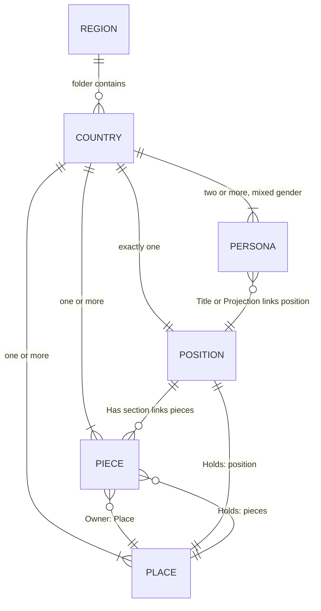

# ARCHITECTURE.md

*Cultures world architecture. Based on [KAI HACKS AI Architecture](https://kaihacks.ai/architecture.html).*

*This document describes the architecture decisions for the Cultures world.*

*First shot - derived primarily from the Germany sample (position, piece, place, persona). Divergent shapes in other countries will surface as validation findings, not silent acceptance.*

---

## General

### Title

Each authored file opens with a `# Type: Name` heading followed by a `## Tagline` line on the next line.

- `# Position: German`
- `# Piece: The Unfinished Reckoning`
- `# Place: Berlin`
- `# Persona: Hanna`
- `# Process: The World is Spinning`

The tagline is a single declarative sentence in title case ending with a period.

---

### Owner

Every authored file has an `## Owner` block. It anchors the file to the world and identifies its structural parent.

Owner format depends on type:

| Type | Owner content |
|------|---------------|
| position | `- Project: Cultures` (country anchor, no parent inside the world) |
| place | `- Project: Cultures` (country locale, no parent inside the world) |
| piece | `- Place: [<Place Name>](culture_<adj>_place_<name>.md)` |
| persona | `- Project: Cultures` |
| process | `- Project: Cultures` |
| engine (stack, instructions) | `- Project: Cultures` |

> **Open:** several existing files use `- *` as the Owner anchor. The asterisk is undocumented. This architecture standardises on `- Project: Cultures` for top-level files; `- *` files need migration. See "To document".

---

### Sections

Section names and order are **per file type**. No section may be omitted or reordered within its type. Cultures does not use a single global section list (this differs from Autobahn).

Section sets are defined per type below.

---

### Footer

Every file closes with a version footer on its own line, preceded by a blank line:

`vX.Y.Z - KAI Worlds`

Above the version footer, files carry a single italic file-stamp line:

`*<basename>.md - DD.MM.YYYY*`

The basename matches the file's actual basename; the date is the file's authoring or last-edit date in `DD.MM.YYYY` format.

> **Open:** `engine/stack.md` currently uses `v0.1.0 - CULTURES`. Architecture canonicalises on `... - KAI Worlds`.

---

### Version

Versioning follows semantic versioning: `major.minor.patch`. The bump-type / pre-commit / version-sync workflow from Autobahn is not yet adopted; see "To document".

---

### Encoding

Files are UTF-8, no byte-order mark.

> **Open:** several existing files start with U+FEFF. They are non-conformant and need cleanup.

---

### Filenames

All filenames use ASCII characters only. Underscores separate words. No hyphens or special characters (no accented letters, no eszett, no other diacritics). Every file basename in a deployed bundle is unique.

**Patterns:**

- `regions/<region>/<country>/culture_<adj>_position.md`
- `regions/<region>/<country>/culture_<adj>_piece_<descriptor>.md`
- `regions/<region>/<country>/culture_<adj>_place_<descriptor>.md`
- `regions/<region>/<country>/persona_<name>.md`
- `engine/<file>.md` for engine root files
- `engine/<platform>/<file>.md` for per-AI instructions

`<adj>` is the lowercase culture adjective (e.g. `german`, `french`, `japanese`).
`<descriptor>` and `<name>` use ASCII lowercase with underscores.

> **Open:** `persona_<name>.md` does not carry the culture adjective. Two countries can collide on `persona_anna.md` in a flat deploy. Either:
> a) prefix personas with the culture adjective: `persona_<adj>_<name>.md`, or
> b) scope persona basenames per country (deploy bundles must therefore not flatten personas).

---

## File Relationships

### Minimum per country

Every country folder must contain at least:

- **1 position** (exactly one - position is the country's anchor)
- **1 piece**
- **1 place**
- **2 personas**, with at least one projecting as male and at least one projecting as female (formal definition pending - see [Persona](#persona) and the related Open question)

More is allowed; less is a validation error.

### Cross-file constraints

- Folder structure is the authority: `regions/<region>/<country>/` owns every file for that country.
- Each piece declares its place in Owner. The linked place must exist as a sibling in the same country folder.
- Each place's Holds lists the country's position and one or more pieces. Both must exist as siblings.
- Each persona links to the country's position. The link target must exist as a sibling.
- All cross-file links inside a country resolve to a sibling in the same folder. Engine references use a relative path up to `engine/`.

Sync failures (broken sibling link, piece pointing at a place that does not exist, persona projecting onto a missing position, place listing a position or piece that is not a sibling) are validation errors.

---

## Position

The country's operating logic. The structural anchor of the country folder. **Exactly one per country.**

**Sections in order:** `Owner`, `Has`, `Orders`, `Loses`, `Drives`.

- **Has** is what the position carries before the persona arrives. Lists the country's pieces by link.
- **Orders** is what the position commands - the action it produces under pressure.
- **Loses** is what the position cannot keep when the order is followed - the cost the persona pays.
- **Drives** is what the position does on the loss - how it persists past the cost.

**Naming:** `culture_<adj>_position.md`

---

## Piece

The load-bearing historical moment, document, or symbol without which the position's logic loses its shape. **At least one per country**, more allowed.

**Sections in order:** `Owner`, `Place`, `Load Bearing`, `Apparent`, `Yearbook`.

- **Place** restates the piece's geographic anchor (mirroring the Owner block) and describes the physical location.
- **Load Bearing** is what fails if the piece is removed. The position becomes incoherent without this.
- **Apparent** is what is visible today - monuments, media, traces.
- **Yearbook** is the dated timeline of events that made the piece what it is.

**Naming:** `culture_<adj>_piece_<descriptor>.md` where `<descriptor>` names the piece (e.g. `unfinished_reckoning`, `basic_law`).

---

## Place

The capital city or defining location where the country's position does its daily work. **At least one per country**, more allowed.

**Sections in order:** `Owner`, `Shown`, `Holds`, `Offers`, `Withheld`.

- **Shown** is what is visible in the place - landscape, infrastructure, signage.
- **Holds** lists the position and the pieces anchored to the place, by link.
- **Offers** is what the place makes available to a person standing there - the room it opens.
- **Withheld** is what the place does not show without effort - what requires seeking.

**Naming:** `culture_<adj>_place_<descriptor>.md` where `<descriptor>` names the locale (e.g. `berlin`).

---

## Persona

A person doing ordinary work carrying a cultural position they did not choose. **At least two per country, with at least one projecting as male and at least one projecting as female.** More personas, and additional gender expressions, are welcome; the floor is mixed-gender representation.

A persona links to its country's position. Gender is **not** a separate entity the persona links to - it is expressed through the persona's behaviour, distributed across the **PAST** framework (Projection, Action, Shadow, Tell). Like culture, gender is something a person performs, hides, and lets slip - not a tag they carry.

**Sections in order:** `Owner`, `Title`, `Projection`, `Action`, `Shadow`, `Tell`.

### PAST - the persona's operating model

The four core sections form **PAST**. They are the persona's behaviour under pressure:

- **Projection** is what the persona shows to the room. Body, posture, voice, the visible signals. The room takes the projection at face value until something else surfaces.
- **Action** is what the persona produces when pressed. The cue they give without thinking. Coherent with the projection in clean cases; inconsistent in interesting ones.
- **Shadow** is what the persona cannot see while producing the action. Includes what they hide from themselves and what the room does not yet see.
- **Tell** is the small involuntary signal that something other than the projection is also true. The line where the Shadow leaks.

Gender lives across PAST. A persona who projects female, acts in coherent register, shadows nothing inconsistent, and tells nothing surprising reads cleanly as female. A persona whose Projection and Shadow disagree - say, projecting as a woman while technically male, or transitioning, or performing - reads as the gender-fluid case the world should be able to hold.

### Section contents

- **Owner** is `- Project: Cultures`.
- **Title** identifies the persona within the country. Existing files diverge: some use a role/profession in one phrase (`Secondary school history teacher`); others use a position-and-piece link chain (`[German](...) -> [Unfinished Reckoning](...)`). One convention must be chosen; see Open.
- **Position link:** every persona links to their country's position. The link appears in either Title or the first line of Projection (current files diverge); see Open.
- **Projection / Action / Shadow / Tell** as defined under PAST.

**Naming:** `persona_<name>.md` (see naming Open question).

---

## Region and Country

Regions and countries are **folders, not files**. There is no `region_europe.md` or `country_germany.md`. The folder name is the structural anchor; its contents enumerate the country's position, pieces, places, and personas.

Region values: `africa`, `americas`, `asia`, `europe`, `oceania`.

A country is a sub-folder under a region. Country folder names are ASCII lowercase with underscores (e.g. `czech_republic`, `north_macedonia`).

---

## Engine

The engine is the world frame - the rules that make the world run regardless of which cultures are loaded. Engine files live at `engine/`:

- `engine/stack.md` - shared architecture overview.
- `engine/process_world_is_spinning.md` - the master loop process all places connect to.
- `engine/<platform>/` - per-AI instructions for `claude/`, `copilot/`, `gemini/`. Each platform sub-folder carries the engine pieces in the form that platform expects.

Process files use the section set: `Owner`, `Initiated by`, `Direction`, `Lever`, `Echo`.

> **To formalise:** the section contracts for `stack.md` and the per-platform instruction files are not yet specified.

---

## Deployment

The world deploys flat to an AI project: every file lands in one folder. The release pipeline emits per-region zips and PDFs from `regions/<region>/`, an engine zip per platform from `engine/<platform>/`, and an all-regions bundle (see `.github/workflows/build-zips.yml` and `build-pdfs.yml`).

The single author-facing rule: **every file basename in a deployed bundle is unique**.

> **Open:** the per-region bundle currently flattens personas alongside cultures. Combined with personas not carrying the culture adjective, two countries can collide. See the persona naming Open question.

---

## To document

- **Owner anchor for top-level files** - `- *` (current, undocumented) vs `- Project: Cultures` (proposed). This architecture stipulates `- Project: Cultures`; existing `- *` files need migration.
- **Persona basename uniqueness** - either prefix with the culture adjective or keep personas country-scoped (no flat deploy of personas).
- **Mixed-gender minimum: formal definition and enforcement** - gender lives across PAST. A persona who projects female may technically be male in their Shadow (gender-fluid, transitioning, performing). The mixed-gender rule ("at least one male, at least one female") needs a precise reading: does it count Projection, the technical body in Shadow, or both? And how does the L2 validator read it? Projection is prose; the technical body, when it differs, surfaces in Shadow or Tell. Until the reading is specified, the constraint cannot be enforced mechanically and L2 treats it as deferred.
- **Persona Title convention** - `persona_hanna.md` uses Title for role/profession; `persona_thomas.md` uses Title for the position-and-piece link chain. Pick one. The choice determines whether the position-link L2 rule reads Title or Projection.
- **Footer canonicalisation** - `engine/stack.md` uses `... - CULTURES`; this architecture stipulates `... - KAI Worlds`.
- **BOM cleanup** - several existing files start with U+FEFF; non-conformant with the encoding rule.
- **Engine section contracts** - the section shape for `engine/stack.md` and for per-platform instruction files is not yet specified.
- **Versioning workflow** - bump-type declaration, pre-commit hook, version sync from Autobahn not yet adopted.
- **Position `Has` enumeration** - some countries have multiple pieces; whether `Has` must enumerate all of them or only the load-bearing one needs confirmation.
- **Multi-country sampling** - this architecture is derived primarily from the Germany sample. A pass over a representative country per region (Brazil, Nigeria, Japan, Australia) will confirm whether the section sets and Owner formats hold or need broadening.
- **Cross-country relationships** - currently only `engine/process_world_is_spinning.md` is referenced from every place via relative path. Cross-country culture relationships are not modelled and may not need to be.
