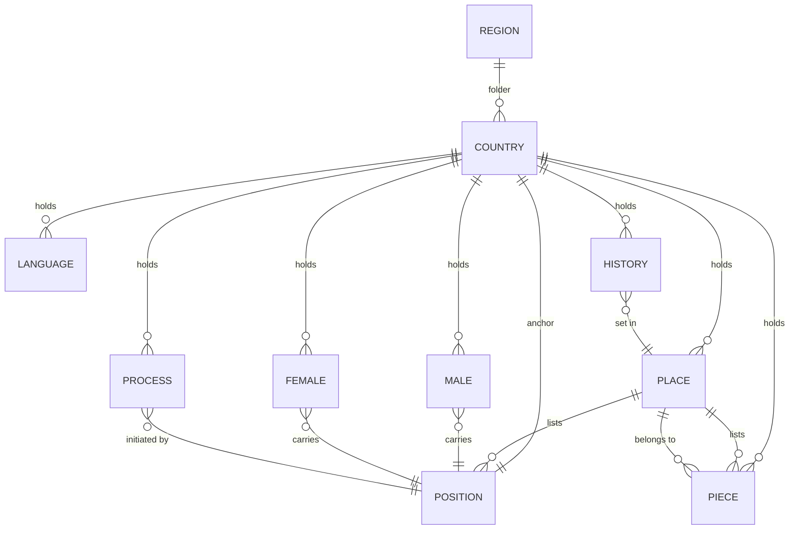

# ARCHITECTURE.md

*Cultures world architecture.*

**Concept:** Built on KAI HACKS AI Architecture and KAIWorlds framework.

**Project Scope:** All content files in `regions/` tree must conform to these rules.

---

## Global File Standards

These rules apply to **all** content files (`.md`) in the repository:

### Encoding

- **Character set:** UTF-8 only
- **Byte-order mark:** Forbidden (UTF-8 no BOM)

### Line Endings

- **Standard:** POSIX LF (`\n`) only
- **Forbidden:** Windows CRLF (`\r\n`)
- **Enforcement:** Git `.gitattributes` normalizes on commit; pre-commit hook strips CRLF on stage

### Trailing Newline

- **Required:** Every file must end with exactly one trailing newline (`\n`)
- **Rationale:** POSIX standard; prevents Git diffs showing "\ No newline at end of file"

### Footer

Every content file ends with three italicized footer lines (v2 schema, Option C):

```
*hofstede: aggregate in [README.md](README.md).*
*khai: <type>*
*<YYYY-MM-DD> | KAI HACKS AI | v<X.Y.Z> | CC-BY-NC-4.0*
```

- **hofstede sentinel line:** Identifies the file as a contributor to the culture's aggregate Hofstede signal. Declared per-country scores live in the country `README.md`, never inline. The leading token `hofstede:` is a stable sentinel for L4e (`tests/test_hofstede_structure.py`). The legacy form `*Hofstede signal: this file contributes to the culture's aggregate score. Declared dimensions live in [README.md](README.md).*` is accepted during the v2 rollout (per PR #130); canonical is the shorter `hofstede:` form above. Cultures migrate to canonical per-country during stage 3 PRs.
- **khai declaration line:** Declares the file's KAI structural type. `<type>` is exactly one of `process`, `position`, `piece`, `place`, `persona`. Filename token and footer must agree (see [Cultures v2 Schema](#cultures-v2-schema) for the mapping). KAIHACKS `khai-tests` v0.1.6 reads this footer to apply the right structural contract. Required in every `culture_*.md` for v2-migrated countries; pre-v2 countries may omit it until their migration PR.
- **IP safeguard line:** Carries authorship/IP metadata in four pipe-separated fields:
  - `<YYYY-MM-DD>` -- ISO 8601 date of the file's last published edit (set when the migration / authoring PR merges to main)
  - `KAI HACKS AI` -- the project owner; same across all culture files
  - `v<X.Y.Z>` -- KAIWorlds release version at the time of the last published edit
  - `CC-BY-NC-4.0` -- license shorthand; the authoritative license text lives in the repo `LICENSE` file at the root
- **Placement:** hofstede sentinel first, then khai declaration, then the IP safeguard line as the final line of the file. Italics on all three; no blank lines between them. A horizontal rule (`---`) separates the footer block from the body.
- **Required in:** All `culture_*.md` files. The legacy single-line version footer (`v0.1.0 - KAI Worlds`) and the filename+date self-stamp (`*culture_<adj>_<kind>_<slug>.md - DD.MM.YYYY*`) are both retired by this spec -- the IP safeguard line carries the same information in one row.
- **Forbidden:** Per-file Hofstede score lines (e.g. `**Hofstede:** PDI 35 · IDV 67 ...`). Scoring is aggregate, not per-file.

### Filenames

ASCII only. Underscores separate words. No hyphens or diacritics. Every basename unique.

Patterns (v2 schema -- 8 canonical kinds):
- `regions/<region>/<country>/culture_<adj>_language_<descriptor>.md` -- language
- `regions/<region>/<country>/culture_<adj>_history_<descriptor>.md` -- history (pivotal moment)
- `regions/<region>/<country>/culture_<adj>_position.md` -- position (state role / cultural anchor)
- `regions/<region>/<country>/culture_<adj>_process_<descriptor>.md` -- process (recurring practice)
- `regions/<region>/<country>/culture_<adj>_piece_<descriptor>.md` -- piece (cultural artifact or concept)
- `regions/<region>/<country>/culture_<adj>_place_<descriptor>.md` -- place
- `regions/<region>/<country>/culture_<adj>_male_<name>.md` -- male persona
- `regions/<region>/<country>/culture_<adj>_female_<name>.md` -- female persona

`<adj>` = lowercase culture adjective (e.g., `german`, `french`).

Legacy v1 pattern, still accepted for countries not yet on the v2 migration list:
- `regions/<region>/<country>/culture_<adj>_persona_<name>.md` -- persona (in v2, split into `male_` and `female_` filenames)

In v1, `piece_*` was overloaded to mean both "cultural artifact" and "pivotal historical moment". v2 splits this into `piece_*` (artifact / concept) and `history_*` (pivotal moment). Migration PRs rename existing `piece_*` files to `history_*` where the file is actually history, and author an authentic `piece_*` where the old `piece_*` doubled.

### Style

- **Em-dashes:** Forbidden (U+2014 `—`). Use hyphens (`-`) instead.
- **Ambiguity:** No literal Unicode escape sequences (`\uXXXX`).
- **Clarity:** No Unicode replacement character (U+FFFD `�`).

---
## Sourcing & IP Standards

These rules apply to all content files across all countries.

### Sourcing Principle

All content is authored with this core principle:

**"Use facts (which are not copyrightable) carried in the author's own expression."**

- **Facts** (sourced): Historical events, geographical locations, cultural references, Hofstede scores
- **Expression** (original): How those facts are narrated, framed, and integrated into positions, pieces, and places

This mirrors Autobahn's approach and ensures originality while respecting factual accuracy.

### Source Hierarchy

Factual claims are verified against sources in this order of preference:

1. **Official sources:** Government institutions, cultural organizations, official archives
2. **Academic sources:** University press, historical societies, peer-reviewed research
3. **Secondary sources:** Wikipedia (for widely-known facts), encyclopedias
4. **Journalistic sources:** Newspapers, media archives, reporting
5. **Local knowledge:** Direct observation, expert interviews (documented)

Each country's REFERENCES.md documents the sourcing hierarchy applied to that country's content.

### IP Safeguards

**Close-paraphrase risk:** Occasional accidental close-paraphrase may occur despite care. If you identify potential IP concerns:

1. Open a GitHub issue with:
   - The file and specific passage
   - The suspected source
   - A link to the original source
2. Describe the pattern (identical phrasing, structure, or fact ordering)
3. The validation layer L4d (plagiarism heuristics) will flag patterns for review

**Resolution:** Confirmed issues are rewritten in original expression. REFERENCES.md documents the protocol.

---
## General

### Title

Each file opens with `# Type: Name` followed by `## Tagline`.

Examples:
- `# Position: German`
- `# History: The Grundgesetz`
- `# Piece: The Unfinished Reckoning`
- `# Place: Berlin`
- `# Persona: Hanna` (or `# Male: Christian` / `# Female: Brigitte` in v2)

### Owner

Every file has an `## Owner` block anchoring it to the world. The block is exactly two list items, in this order:

```
## Owner
- Project: Cultures
- <Tier>: <Value>
```

The second tier names the file's scope:

| Location | Second tier |
|----------|-------------|
| `engine/*.md` (universal) | `- Scope: Universal` |
| `regions/<region>/<country>/*.md` (any region file: position, piece, place, persona, language, process, history, male, female) | `- Culture: <Country>` (English display name, e.g. `Germany`) |

No bold, no link decoration, no extra lines. The list-bullet is `-`. Anything else (`- *`, `- **Project:** Cultures`, suffixes like `— Americas`, second-tier `Place:` links) is a legacy artefact slated for migration; the L2 validator will reject these on changed files going forward.

### Sections

Section order is fixed per file type. See below.

---

## Cultures v2 Schema

Every country has **8 canonical kinds**, mapped to the **5 KAI structural types** from the KAI HACKS AI Architecture. The 8 kinds are Cultures-specific specializations; the 5 KAI structural types are the universal contracts every validator applies.

### The 8 kinds and their KAI mapping

| Cultures kind | KAI structural type | Section set | Filename token |
|---|---|---|---|
| Language | position | Has / Orders / Loses / Drives | `language` |
| History | piece | Place / Load Bearing / Apparent / Yearbook | `history` |
| Position | position | Has / Orders / Loses / Drives | `position` |
| Process | process | Initiated by / Direction / Lever / Echo | `process` |
| Piece | piece | Place / Load Bearing / Apparent / Yearbook | `piece` |
| Place | place | Shown / Holds / Offers / Withheld | `place` |
| Male persona | persona | Projection / Action / Shadow / Tell | `male` |
| Female persona | persona | Projection / Action / Shadow / Tell | `female` |

The first column is what Cultures authors think in; the second column is what validators key off. The mnemonic for the section sets is **HOLD** (position), **PLAY** (piece), **IDLE** (process), **SHOW** (place), **PAST** (persona).

Cultures-specific kinds (language, history, male, female) inherit the section set of their KAI type. A `culture_german_language_german.md` follows the same Has / Orders / Loses / Drives contract that `culture_german_position.md` does; a `culture_german_history_grundgesetz.md` follows the same Place / Load Bearing / Apparent / Yearbook contract that a `culture_german_piece_bauhaus.md` does.

### khai declaration footer

Every `culture_*.md` ends with a `*khai: <type>*` line (see [Footer](#footer)) declaring its KAI structural type. The filename token and the footer must agree:

| Filename | khai footer |
|---|---|
| `culture_german_language_german.md` | `*khai: position*` |
| `culture_german_history_grundgesetz.md` | `*khai: piece*` |
| `culture_german_position.md` | `*khai: position*` |
| `culture_german_process_einkaufen.md` | `*khai: process*` |
| `culture_german_piece_bauhaus.md` | `*khai: piece*` |
| `culture_german_place_brandenburg_gate.md` | `*khai: place*` |
| `culture_german_male_christian.md` | `*khai: persona*` |
| `culture_german_female_brigitte.md` | `*khai: persona*` |

The two surfaces are deliberately redundant: filename drives Cultures-side completeness (`tests/test_completeness.py` counts kinds), footer drives KAIHACKS structural validation (`khai-tests` v0.1.6 picks the section contract). A mismatch is a hard fail.

### Per-country v2 opt-in

v2-strict validation runs per-country, opt-in via `data/v2_migrated_countries.txt` (one slug per line, blank lines and `#` comments ignored). Countries on the list must satisfy the v2 contract (all 8 kinds present, khai footer on every `culture_*.md`, persona file split into `male_` / `female_`). Countries off the list run legacy v1 rules.

A migration PR (`culture/<country>`) is one atomic commit that:
1. Renames `persona_*` to `male_*` / `female_*`
2. Renames `piece_*` to `history_*` where the file is actually a pivotal moment
3. Authors an authentic `piece_*` where the old `piece_*` doubled as history
4. Adds the `*khai: <type>*` footer to every `culture_*.md`
5. Adopts the v2 footer block (`*hofstede:`, `*khai:`, IP safeguard line) on each migrated file
6. Updates the country `README.md` audit table to the canonical 8-kind order via `scripts/update_hofstede_readme.py`
7. Adds the country slug to `data/v2_migrated_countries.txt`

`data/v2_migrated_countries.txt` is carved into `SAFE_PATTERNS` so culture branches can edit it alongside the per-country file renames. The marker is forward-only: removing a country from the list is unsupported; to back out a migration, revert the PR.

Once every developed country is on the list, stage 4 will deprecate the opt-in mechanism and the validator will become unconditionally v2.

---

## Gender Position Framework

**Gender positions are universal, engine-level files** that exist above the culture layer. Every persona links to both a gender position and a culture position; in v2, the persona's filename also encodes its projected gender.

### Universal Gender Positions

- `engine/position_male.md` - Male gender position (applies to all cultures)
- `engine/position_female.md` - Female gender position (applies to all cultures)

These positions describe the social/embodied role that gender confers, independent of culture. Gender is a layer that intersects with culture; every persona exists at the intersection of both.

### Gender Linking Pattern

All persona files include gender position links in the **Projection** section:

```markdown
## Projection
[Name] is a [man/woman](../../../engine/position_male.md / position_female.md)
from [Country](../../../engine/position_[culture].md).
[Persona-specific projection content...]
```

Examples:
- Male persona (`culture_german_male_christian.md` in v2 / `culture_german_persona_christian.md` in v1): `Christian is a [man](../../../engine/position_male.md) from [Germany](../../../engine/position_german.md).`
- Female persona (`culture_german_female_hanna.md` in v2 / `culture_german_persona_hanna.md` in v1): `Hanna is a [woman](../../../engine/position_female.md) from [Germany](../../../engine/position_german.md).`

### Linking Mechanics

- **From:** `regions/REGION/COUNTRY/culture_*_male_*.md` or `culture_*_female_*.md` (v2) / `culture_*_persona_*.md` (v1)
- **To gender:** `../../../engine/position_male.md` or `../../../engine/position_female.md`
- **To culture:** `../../../engine/position_[culture].md` or `culture_[culture]_position.md` (local reference)

The triple `../../../` accounts for depth: `regions/europe/germany/` goes up three levels to reach the repo root, then into `engine/`.

**Canonical form is the only supported form.** Cross-level links (persona → engine, and any future region → engine) MUST use directory-relative paths with `../../../` — not bare `engine/...` (which renders as a sibling-directory link in every Markdown renderer) and not `/engine/...` (which only works in some surfaces). The link validator enforces this: paths are resolved relative to the source file's directory only, with no repo-root fallback.

### v2 vs v1: where gender is encoded

| Surface | v1 | v2 |
|---|---|---|
| Filename | `persona_<name>` | `male_<name>` / `female_<name>` |
| khai footer | absent | `*khai: persona*` |
| Projection link | `position_male.md` / `position_female.md` (required) | `position_male.md` / `position_female.md` (required) |
| Title line | `# Persona: Name` | `# Male: Name` or `# Female: Name` (or kept as `# Persona: Name`) |

The Projection link remains the authoritative source for gender. The filename and title add redundancy so reviewers can scan a folder listing and immediately see the gender mix without opening each file.

### All New Personas

Every new persona created must:
1. Include gender position link (mandatory)
2. Include culture position link (mandatory)
3. Maintain persona-specific projection content
4. In v2: use `male_` or `female_` filename token and `*khai: persona*` footer

### Existing Personas

Existing personas with v1 layout remain valid until the country's migration PR. The migration PR renames the persona file and adds the khai footer atomically.

---

## Hofstede Foundation

Every culture is rooted in **Hofstede's Cultural Dimensions Theory**, a framework identifying six measurable dimensions of cultural variation:

### Six Dimensions

1. **Power Distance Index (PDI):** How much people accept unequal power distribution. Low PDI cultures emphasize equality; high PDI accept hierarchy as natural.

2. **Individualism (IDV):** Individual vs. collective orientation. High IDV prioritizes personal achievement and autonomy; low IDV emphasizes group harmony and loyalty.

3. **Uncertainty Avoidance Index (UAI):** Comfort with ambiguity and risk. High UAI seek rules, structure, and predictability; low UAI are more flexible and tolerant of uncertainty.

4. **Masculinity (MAS):** Assertiveness and competitiveness vs. caring and cooperation. High MAS cultures value achievement and competition; low MAS prioritize relationships and quality of life.

5. **Long-Term Orientation (LTO):** Future focus and adaptation vs. past/present focus and tradition. High LTO prioritize long-term planning; low LTO emphasize immediate results and tradition.

6. **Indulgence (IND):** Gratification of desires vs. restraint. High IND allow relatively free gratification; low IND show self-discipline and restraint.

Each dimension scores 0-100. Hofstede research provides published scores for most countries based on empirical surveys.

### Band Contract

Canonical Hofstede band thresholds, pinned by `scripts/audit_readme_bands.py` and `tests/test_audit_readme_bands.py`:

| Score range | Band |
|---|---|
| 0-39 | Low |
| 40-69 | Moderate |
| 70-100 | High |

"Medium" is an accepted prose alias for "Moderate" (the audit normalizes for equivalence but surfaces the non-canonical word in the `declared` column). README band labels and any prose mentions (e.g. `**Low PDI + High IDV:**`) must agree with each dimension's score.

### Application in Cultures

Each v2 kind expresses the cultural dimensions through a different surface:

- **Language** carries the dimensional logic in how meaning is encoded -- terms of address (PDI), pronoun handling (IDV), structural strictness (UAI).
- **History** records pivotal moments where the dimensions emerged or were tested -- foundational documents, wars, settlements.
- **Position** embodies the culture's operating logic shaped by all six dimensions.
- **Process** shows the dimensions running on a loop -- recurring practices that re-enact the cultural profile.
- **Piece** is an artifact or concept where one or two dimensions are concentrated -- a film, a building, an idea.
- **Place** shows where dimensions are visible in daily life -- streetscapes, institutions, public space.
- **Male / Female personas** carry the tension of living within a culture's dimensional profile, with gender as an additional axis.

### Scoring is Aggregate, Not Per-File

The dimensional signal is **distributed across all culture files for a given culture, not concentrated in any one file**. The validation contract follows from this:

- The country `README.md` is the **single source of truth** for declared scores. No culture file carries scores in its body or footer.
- Each `culture_*.md` file contributes keywords (in its native language) to the country's aggregate signal. Position carries the spine; piece/place/process/persona/language/history each carry the dimensions they naturally express.
- The validating layer is **L4f** (`tests/validate_hofstede_derived.py`): it sums keyword counts across every culture file in the country and compares the derived score to the README declared score, with ±10 PASS / ±5 EXCELLENT tolerance.
- **L4e** is structure-only (README has the section, score table, source attribution). It does not score per-file content.
- Each culture file ends with the **hofstede sentinel line** (see [Footer](#footer)) declaring its participation in the aggregate model and pointing at the README.

Per-file score footers (e.g. `**Hofstede:** PDI 35 · IDV 67 ...`) are forbidden — they imply per-file scoring and create a false alignment target.

### Documentation Requirements

Every country's README must include:

1. **Hofstede Summary Table:** Listing all six dimensions with scores
2. **Source:** Either empirical Hofstede research (published scores) or best judgment with reasoning
3. **Explanation:** How these dimensions shape the 8 kinds (language, history, position, process, piece, place, male, female)

### Empirical vs. Approximation

- **If empirical research exists:** Use published Hofstede scores and cite the source
- **If no empirical data exists:** Use best judgment approximation, clearly labeled as "Approximation" with reasoning explaining how scores were derived

Both approaches are valid; the key is transparency about sourcing.

### Scaffolding Approach

Rather than pre-populating all countries with README/REFERENCES at once, documentation is scaffolded on-demand as countries are touched:

1. **Infrastructure:** `data/hofstede_scores.json` contains 50+ countries with empirical scores
2. **Generator:** `scripts/scaffold_country.py` (v0.2.0, v2-aware) creates README.md and REFERENCES.md for any country
3. **Updater:** `scripts/update_hofstede_readme.py` rewrites the Hofstede Cultural Dimensions and Alignment Status tables in an existing README -- deterministic per-country sync
4. **Workflow:** When you start a country, run:
   ```bash
   python3 scripts/scaffold_country.py --apply COUNTRY
   git add regions/REGION/COUNTRY/{README,REFERENCES}.md
   # Then run validators and edit as needed
   ```
5. **Baseline:** Germany is the canonical template - all scaffolded countries follow this structure

This approach:
- Avoids bulk generation of 200+ files
- Ensures consistency (same templates, same validator checks)
- Allows human review of Hofstede sourcing before content is written
- Keeps the baseline (Germany) as the reference standard for all future countries

---

## File Relationships



---

## Minimum per Country

Every country folder must contain, in the canonical v2 order:

1. **1 language** (the linguistic anchor)
2. **1 history** (a pivotal moment of the culture's formation)
3. **1 position** (exactly one - the country's anchor)
4. **1 process** (a culture-level recurring mechanism)
5. **1 piece** (cultural artifact or concept)
6. **1 place** (capital or defining location)
7. **1 male persona**
8. **1 female persona**

More of each is allowed (except position, which is exactly one).

**v1 minimum** (still accepted for countries not on the v2 migration list): 1 position, 1 piece, 1 place, 2 personas (mixed-gender), 1 language, 1 process. Mixed-gender means at least one persona linking `engine/position_male.md` AND at least one linking `engine/position_female.md` via its `## Projection` section. The L4a validator enforces this from the link target alone, language-agnostic. In v2 the link rule is unchanged but the filename also encodes the projected gender (`male_*` / `female_*`), so the gender mix is visible from the folder listing.

---

## Country README Structure

Every country folder must contain a **README.md** that follows this structure:

```markdown
# <Country> - Culture Content

**Language(s):** <Language(s)>

---

## Download

The complete <Country> culture package for Claude.ai:
- [**<country>.zip**](https://github.com/ChBrain/Cultures/releases/latest/download/<country>.zip)

Includes all culture files + engine stack + Claude instructions.

---

## Install

1. Extract the zip to your Claude project
2. Upload all files (engine/ + culture/)
3. Run the engine/instructions.md to initialize
4. Reference culture_<adj>_*.md files in your prompts

## Content Overview

[Table of files and descriptions, ordered by the 8 v2 kinds: language, history, position, process, piece, place, male, female]

## Hofstede Cultural Dimensions - <Country>

[Full Hofstede documentation]

---

Audited [DATE]

*v0.1.0 - Kai Schlueter - Cultures - [MONTH YEAR]*
```

### Purpose of Three-Section Design

- **Download:** Instructions specific to GitHub releases (removed when building zips)
- **Install:** Instructions that work in both GitHub context and in the zip (kept in zips)
- **Content:** Culture overview, Hofstede dimensions, file descriptions (kept in zips)

### Transformation for Release Zips

When building release zips in `.github/workflows/build-zips.yml`, the workflow:
1. Reads each country's README.md
2. Strips everything up to (and including) the first `---` divider (removes Download section)
3. Includes the remaining Install + Content sections in the zip
4. Flattens relative links from nested folder structure (e.g., `../../engine/stack.md` → `stack.md`)

This allows README.md to work identically in both contexts with minimal transformation: the same file serves GitHub browsers (full) and zip users (trimmed).

---

## Position

The country's operating logic.

**Sections:** `Owner`, `Has`, `Orders`, `Loses`, `Drives`.

- **Has**: Lists the country's pieces by link.
- **Orders**: The action the position commands.
- **Loses**: The cost paid when the order is followed.
- **Drives**: How the position persists past the cost.

**Naming:** `culture_<adj>_position.md`

**khai footer:** `*khai: position*`

---

## History

A pivotal historical moment in the culture's formation -- a founding document, a war, a settlement, a fall. In v1, this was conflated with `piece`; v2 separates them so pieces can be artifacts and concepts while history carries the dated events.

History reuses the KAI **piece** structural type (the **PLAY** mnemonic: Place / Load Bearing / Apparent / Yearbook). The same section set as a `piece`.

**Sections:** `Owner`, `Place`, `Load Bearing`, `Apparent`, `Yearbook`.

- **Place**: Where the moment happened.
- **Load Bearing**: What in the culture's present logic depends on this moment.
- **Apparent**: What is visible today as a result.
- **Yearbook**: Dated timeline of events leading into and out of the moment.

**Naming:** `culture_<adj>_history_<descriptor>.md`

**khai footer:** `*khai: piece*` (history maps to the KAI piece structural type)

Example: `culture_german_history_grundgesetz.md`.

---

## Piece

A cultural artifact, work, or concept where one or two dimensions are concentrated -- a film, a building, a movement, an idea. In v2, history is split out into its own kind (see [History](#history)); piece now carries the artifact / concept meaning.

**Sections:** `Owner`, `Place`, `Load Bearing`, `Apparent`, `Yearbook`.

- **Place**: The place the piece lives in or speaks from.
- **Load Bearing**: What fails if this piece is removed from the culture's self-understanding.
- **Apparent**: What is visible about the piece today.
- **Yearbook**: Dated context for the piece (creation, reception, revisions).

**Naming:** `culture_<adj>_piece_<descriptor>.md`

**khai footer:** `*khai: piece*`

---

## Place

The capital or defining location where the position does its daily work.

**Sections:** `Owner`, `Shown`, `Holds`, `Offers`, `Withheld`.

- **Shown**: What is visible - landscape, infrastructure, signage.
- **Holds**: Lists this place's position and pieces.
- **Offers**: What the place makes available.
- **Withheld**: What requires seeking to see.

**Naming:** `culture_<adj>_place_<descriptor>.md`

**khai footer:** `*khai: place*`

---

## Language

A linguistic anchor of the culture - the standard, dialect, or register through which the culture speaks itself into existence. Language is operating logic for a linguistic anchor, so it reuses the KAI **position** structural type (the **HOLD** mnemonic: Has / Orders / Loses / Drives).

**Sections:** `Owner`, `Has`, `Orders`, `Loses`, `Drives`.

- **Has**: What the language carries (norms, institutions, registers).
- **Orders**: What the language demands of speakers.
- **Loses**: The cost of speaking it.
- **Drives**: How the language persists past the cost.

**Naming:** `culture_<adj>_language_<descriptor>.md`

**khai footer:** `*khai: position*` (language maps to the KAI position structural type)

Example: `culture_german_language_hochdeutsch.md`.

---

## Process (culture-level)

A recurring mechanism through which the culture's position acts in time. Engine-level processes (`engine/process_*.md`) describe world-level loops; culture-level processes describe culture-specific loops, initiated by the culture's position.

**Sections:** `Owner`, `Initiated by`, `Direction`, `Lever`, `Echo`.

- **Initiated by**: The position (or sub-position) that triggers the process.
- **Direction**: Where the process pushes the culture.
- **Lever**: The mechanism that does the work.
- **Echo**: What remains after the process completes.

**Naming:** `culture_<adj>_process_<descriptor>.md`

**khai footer:** `*khai: process*`

Example: `culture_german_process_erinnern.md`.

---

## Persona (Male / Female)

A person doing ordinary work carrying a cultural position they did not choose. **In v2, every country requires at least one male and at least one female persona, each as its own file with the gender encoded in the filename.** More personas, and additional gender expressions, are welcome; the floor is mixed-gender representation.

A persona links to its country's position. Gender is **not** a separate entity the persona links to in the body -- it is expressed through the persona's behaviour, distributed across the **PAST** framework (Projection, Action, Shadow, Tell). The Projection section carries the engine gender position link; in v2 the filename also encodes the projected gender.

Every persona intersects gender and culture. The **Projection** section establishes both:

```markdown
## Projection
[Name] is a [man/woman](../../../engine/position_male.md / position_female.md)
from [Country](../../../engine/position_[culture].md).
[Persona-specific projection content...]
```

**Sections in order:** `Owner`, `Title`, `Projection`, `Action`, `Shadow`, `Tell`.

### PAST - the persona's operating model

The four core sections form **PAST**. They are the persona's behaviour under pressure:

- **Projection** is what the persona shows to the room. Body, posture, voice, the visible signals. The room takes the projection at face value until something else surfaces.
- **Action** is what the persona produces when pressed. The cue they give without thinking. Coherent with the projection in clean cases; inconsistent in interesting ones.
- **Shadow** is what the persona cannot see while producing the action. Includes what they hide from themselves and what the room does not yet see.
- **Tell** is the small involuntary signal that something other than the projection is also true. The line where the Shadow leaks.

Gender lives across PAST. A persona who projects female, acts in coherent register, shadows nothing inconsistent, and tells nothing surprising reads cleanly as female. A persona whose Projection and Shadow disagree - say, projecting as a woman while technically male, or transitioning, or performing - reads as the gender-fluid case the world should be able to hold.

### Section contents

- **Owner** is the canonical two-line block (see Owner above): `- Project: Cultures` then `- Culture: <Country>`.
- **Title** is a plain role or profession (`Rechtsanwältin`, `Softwareentwickler`). It identifies the persona within the country. Title carries no links — the position link lives in Projection.
- **Position link:** the first line of Projection carries both the gender position link and the country position link. Pattern: `[<gender>](../../../engine/position_<gender>.md) aus [<Country>](culture_<adj>_position.md).`
- **Projection / Action / Shadow / Tell** as defined under PAST.

**Naming:**
- v2: `culture_<adj>_male_<name>.md` for male personas, `culture_<adj>_female_<name>.md` for female personas
- v1 (legacy, until country migration): `culture_<adj>_persona_<name>.md`

**khai footer:** `*khai: persona*` (both `male_` and `female_` files use the persona KAI type)

**Gender Link Requirements:**
- Male persona: `[man](../../../engine/position_male.md)` in Projection
- Female persona: `[woman](../../../engine/position_female.md)` in Projection
- Non-binary/other: Document in Projection (design TBD)

---

## Folder Structure

```
regions/
  africa/
    country/
      culture_adj_language_descriptor.md
      culture_adj_history_descriptor.md
      culture_adj_position.md
      culture_adj_process_descriptor.md
      culture_adj_piece_descriptor.md
      culture_adj_place_descriptor.md
      culture_adj_male_name.md
      culture_adj_female_name.md
      README.md
      REFERENCES.md
  americas/
  asia/
  europe/
  oceania/
engine/
  position_male.md
  position_female.md
  stack.md
  process_world_is_spinning.md
```

Region values: `africa`, `americas`, `asia`, `europe`, `oceania`.

Country folder names: ASCII lowercase with underscores.

The folder listing is ordered by the canonical 8-kind sequence (language, history, position, process, piece, place, male, female) so reviewers can scan for gaps at a glance.

---

## Region and Country

Regions and countries are **folders, not files**. There is no `region_europe.md` or `country_germany.md`. The folder name is the structural anchor; its contents enumerate the country's 8 kinds.

Region values: `africa`, `americas`, `asia`, `europe`, `oceania`.

A country is a sub-folder under a region. Country folder names are ASCII lowercase with underscores (e.g. `czech_republic`, `north_macedonia`).

---

## Engine

The engine is the world frame - the rules that make the world run regardless of which cultures are loaded. Engine files live at `engine/`:

- `engine/stack.md` - shared architecture overview.
- `engine/process_world_is_spinning.md` - the master loop process all places connect to.
- `engine/<platform>/` - per-AI instructions for `claude/`, `copilot/`, `gemini/`. Each platform sub-folder carries the engine pieces in the form that platform expects.

Engine and culture-level processes share the section set: `Owner`, `Initiated by`, `Direction`, `Lever`, `Echo`. Engine processes describe world-level loops (`engine/process_*.md`); culture-level processes describe culture-specific loops and live in country folders (see Process section above).

> **To formalise:** the section contracts for `stack.md` and the per-platform instruction files are not yet specified.

---

## Deployment

The world deploys flat to an AI project: every file lands in one folder. The release pipeline emits per-region zips and PDFs from `regions/<region>/`, an engine zip per platform from `engine/<platform>/`, and an all-regions bundle (see `.github/workflows/build-zips.yml` and `build-pdfs.yml`).

The single author-facing rule: **every file basename in a deployed bundle is unique**.

The `culture_<adj>_*` prefix on every culture-scoped file (position, history, piece, place, male, female, language, process) ensures basename uniqueness across countries when bundles flatten.

---

## Source Attribution & IP Protection

To avoid accidental intellectual property theft, each country folder includes two files that document sourcing and verify facts:

### README.md (per country)

Located at `regions/<region>/<country>/README.md`.

**Contents:**
- Overview of the country's content (8 kinds: language, history, position, process, piece, place, male, female)
- Sourcing principle: "Facts (verified via sources) + Original expression"
- Source hierarchy (official → academic → secondary)
- Plagiarism safeguard (how to report concerns)
- Content audit status table (ordered by the 8 v2 kinds for at-a-glance gap scanning)

**Purpose:** Public documentation of content origin and verification process.

### REFERENCES.md (per country)

Located at `regions/<region>/<country>/REFERENCES.md`.

**Contents:**
- Authorship statement (Kai Schlueter, AI-assisted)
- Source registry (official institutions, academic, media, Wikipedia)
- Verified facts table (per file - what facts, where verified, audit status)
- Plagiarism detection protocol (7+ word check, audit workflow)
- How to report IP concerns (GitHub issue template)

**Purpose:** Detailed source documentation and audit trail for reviewers and auditors.

### Sourcing Model

Following Autobahn's principle:

**"Use facts (which are not copyrightable) carried in the author's own expression."**

- **Facts**: Historical events, geographical locations, cultural references (sourced)
- **Expression**: How facts are narrated, framed, integrated into positions/pieces/personas (original)

### Verification Hierarchy

When verifying facts in place/piece/history/position files:

1. **Official government / institutional sources** (ministries, archives, official city sites)
2. **Academic references** (universities, historical societies, peer-reviewed)
3. **Secondary sources** (Wikipedia, encyclopedias, major media)
4. **Journalistic reporting** (newspapers, news agencies, media archives)

### Plagiarism Detection

**Risk threshold:** 7+ consecutive non-trivial words verbatim from any source.

**Example:**
- Source: "The fall of the Berlin Wall on November 9, 1989, marked the beginning of the end..."
- Our text (risky): "The fall of the Berlin Wall on November 9, 1989, marked..." ← Matches exactly, rewrite needed
- Our text (safe): "On November 9, 1989, the Berlin Wall fell, symbolizing the start of East Germany's transformation..." ← Paraphrased

### Audit Workflow

Spot-check protocol for sampled content:

1. Extract all distinct factual claims (dates, places, quantities, events)
2. Verify each against hierarchical source list
3. Search source text for paraphrase risk (7+ word sequences)
4. Mark verdict: **clean** (verified, no risk), **minor** (one small issue), **issues** (factual error or paraphrase risk)

### Reporting IP Concerns

If you find potential plagiarism or factual errors:

1. Open a GitHub issue: `IP concern: [Country] - [File name]`
2. Include: exact passage, suspected source (with URL), why it concerns you
3. We will investigate within 7 days and rewrite if confirmed

---

## To document

- **v2 migration sweep** - per-country migration PRs add countries to `data/v2_migrated_countries.txt` and bring their content to the 8-kind layout (rename `persona_*` to `male_*`/`female_*`, split `piece_*` into `piece_*` + `history_*` where the file was actually history, add khai footers, adopt the 3-line IP footer). Tracked in `docs/migration/cultures-kind-schema-history-piece-split.md`.
- **Legacy Owner-block migration** - the canonical Owner block is locked (see Owner above). The L2 validator enforces it on changed files. The corpus still contains hundreds of legacy shapes (`- *` placeholders, bolded `- **Project:**`, `— Americas` suffixes, `- Place: [...]` second tiers); these will fail validation when their file is next touched.
- **Legacy mixed-gender coverage** - the rule is locked (see Minimum per Country above) and L4a enforces it on changed countries. Most legacy countries currently have personas without engine gender links; they will fail the country check when any of their files is next touched.
- **BOM cleanup** - several existing files start with U+FEFF; non-conformant with the encoding rule. The pre-commit hook strips BOMs from staged files; legacy files retain theirs until next touched.
- **Engine section contracts** - the section shape for `engine/stack.md` and for per-platform instruction files is not yet specified.
- **Versioning workflow** - bump-type declaration, pre-commit hook, version sync from Autobahn not yet adopted; the IP safeguard line's `v<X.Y.Z>` field is set manually per migration PR until the workflow lands.
- **Position `Has` enumeration** - some countries have multiple pieces; whether `Has` must enumerate all of them or only the load-bearing one needs confirmation.
- **Multi-country sampling** - this architecture is derived primarily from the Germany sample. A pass over a representative country per region (Brazil, Nigeria, Japan, Australia) will confirm whether the section sets and Owner formats hold or need broadening.
- **Cross-country relationships** - currently only `engine/process_world_is_spinning.md` is referenced from every place via relative path. Cross-country culture relationships are not modelled and may not need to be.

---

*v0.2.0 - KAI Worlds*
