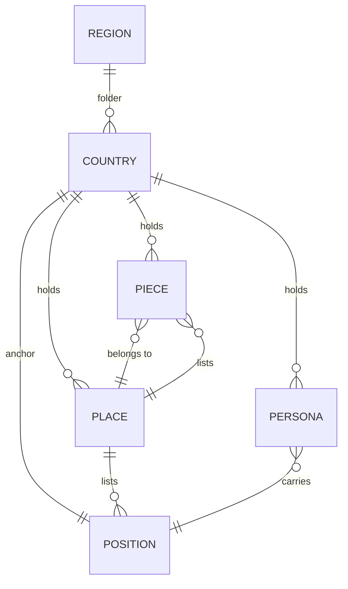

# ARCHITECTURE.md

*Cultures world architecture.*

---

## General

### Title

Each file opens with `# Type: Name` followed by `## Tagline`.

Examples:
- `# Position: German`
- `# Piece: The Unfinished Reckoning`
- `# Place: Berlin`
- `# Persona: Hanna`

### Owner

Every file has an `## Owner` block anchoring it to the world.

| Type | Owner |
|------|-------|
| position | `- Project: Cultures` |
| place | `- Project: Cultures` |
| piece | `- Place: [Place Name](culture_<adj>_place_<name>.md)` |
| persona | `- Project: Cultures` |

### Sections

Section order is fixed per file type. See below.

### Footer

```
vX.Y.Z - KAI Worlds
```

### Version

Semantic versioning: `major.minor.patch`.

### Encoding

UTF-8, no byte-order mark.

### Filenames

ASCII only. Underscores separate words. No hyphens or diacritics. Every basename unique.

Patterns:
- `regions/<region>/<country>/culture_<adj>_position.md`
- `regions/<region>/<country>/culture_<adj>_piece_<descriptor>.md`
- `regions/<region>/<country>/culture_<adj>_place_<descriptor>.md`
- `regions/<region>/<country>/persona_<name>.md`

`<adj>` = lowercase culture adjective (e.g., `german`, `french`).

---

## File Relationships



---

## Minimum per Country

Every country folder must contain:

- **1 position** (exactly one - the country's anchor)
- **1 piece** (historical moment or symbol)
- **1 place** (capital or defining location)
- **2 personas** (at least one male, at least one female)

More of each is allowed.

---

## Position

The country's operating logic.

**Sections:** `Owner`, `Has`, `Orders`, `Loses`, `Drives`.

- **Has**: Lists the country's pieces by link.
- **Orders**: The action the position commands.
- **Loses**: The cost paid when the order is followed.
- **Drives**: How the position persists past the cost.

**Naming:** `culture_<adj>_position.md`

---

## Piece

A historical moment, document, or symbol essential to the position's logic.

**Sections:** `Owner`, `Place`, `Load Bearing`, `Apparent`, `Yearbook`.

- **Load Bearing**: What fails if this piece is removed.
- **Apparent**: What is visible today.
- **Yearbook**: Dated timeline of events.

**Naming:** `culture_<adj>_piece_<descriptor>.md`

---

## Place

The capital or defining location where the position does its daily work.

**Sections:** `Owner`, `Shown`, `Holds`, `Offers`, `Withheld`.

- **Shown**: What is visible - landscape, infrastructure, signage.
- **Holds**: Lists this place's position and pieces.
- **Offers**: What the place makes available.
- **Withheld**: What requires seeking to see.

**Naming:** `culture_<adj>_place_<descriptor>.md`

---

## Persona

A person carrying the position they did not choose. Minimum two per country (one male, one female).

Gender is expressed through **PAST**:

- **Projection**: What the persona shows.
- **Action**: What they do when pressed.
- **Shadow**: What they cannot see about themselves.
- **Tell**: The involuntary signal where Shadow leaks.

**Sections:** `Owner`, `Projection`, `Action`, `Shadow`, `Tell`.

**Naming:** `persona_<name>.md`

---

## Folder Structure

```
regions/
  africa/
    country/
      culture_adj_position.md
      culture_adj_piece_descriptor.md
      culture_adj_place_descriptor.md
      persona_name1.md
      persona_name2.md
  americas/
  asia/
  europe/
  oceania/
engine/
  stack.md
  process_world_is_spinning.md
```

Region values: `africa`, `americas`, `asia`, `europe`, `oceania`.

Country folder names: ASCII lowercase with underscores.

---

## Persona

A person doing ordinary work carrying a cultural position they did not choose. **At least two per country, with at least one projecting as male and at least one projecting as female.** More personas, and additional gender expressions, are welcome; the floor is mixed-gender representation.

A persona links to its country's position. Gender is **not** a separate entity the persona links to - it is expressed through the persona's behaviour, distributed across the **PAST** framework (Projection, Action, Shadow, Tell). Like culture, gender is something a person performs, hides, and lets slip - not a tag they carry.

**Sections in order:** `Owner`, `Title`, `Projection`, `Action`, `Shadow`, `Tell`.

### PAST - the persona's operating model

The four core sections form **PAST**. They are the persona's behaviour under pressure:

- **Projection** is what the persona shows to the room. Body, posture, voice, the visible signals. The room takes the projection at face value until something else surfaces.
- **Action** is what the persona produces when pressed. The cue they give without thinking. Coherent with the projection in clean cases; inconsistent in interesting ones.
- **Shadow** is what the persona cannot see while producing the action. Includes what they hide from themselves and what the room does not yet see.
- **Tell** is the small involuntary signal that something other than the projection is also true. The line where the Shadow leaks.

Gender lives across PAST. A persona who projects female, acts in coherent register, shadows nothing inconsistent, and tells nothing surprising reads cleanly as female. A persona whose Projection and Shadow disagree - say, projecting as a woman while technically male, or transitioning, or performing - reads as the gender-fluid case the world should be able to hold.

### Section contents

- **Owner** is `- Project: Cultures`.
- **Title** identifies the persona within the country. Existing files diverge: some use a role/profession in one phrase (`Secondary school history teacher`); others use a position-and-piece link chain (`[German](...) -> [Unfinished Reckoning](...)`). One convention must be chosen; see Open.
- **Position link:** every persona links to their country's position. The link appears in either Title or the first line of Projection (current files diverge); see Open.
- **Projection / Action / Shadow / Tell** as defined under PAST.

**Naming:** `persona_<name>.md` (see naming Open question).

---

## Region and Country

Regions and countries are **folders, not files**. There is no `region_europe.md` or `country_germany.md`. The folder name is the structural anchor; its contents enumerate the country's position, pieces, places, and personas.

Region values: `africa`, `americas`, `asia`, `europe`, `oceania`.

A country is a sub-folder under a region. Country folder names are ASCII lowercase with underscores (e.g. `czech_republic`, `north_macedonia`).

---

## Engine

The engine is the world frame - the rules that make the world run regardless of which cultures are loaded. Engine files live at `engine/`:

- `engine/stack.md` - shared architecture overview.
- `engine/process_world_is_spinning.md` - the master loop process all places connect to.
- `engine/<platform>/` - per-AI instructions for `claude/`, `copilot/`, `gemini/`. Each platform sub-folder carries the engine pieces in the form that platform expects.

Process files use the section set: `Owner`, `Initiated by`, `Direction`, `Lever`, `Echo`.

> **To formalise:** the section contracts for `stack.md` and the per-platform instruction files are not yet specified.

---

## Deployment

The world deploys flat to an AI project: every file lands in one folder. The release pipeline emits per-region zips and PDFs from `regions/<region>/`, an engine zip per platform from `engine/<platform>/`, and an all-regions bundle (see `.github/workflows/build-zips.yml` and `build-pdfs.yml`).

The single author-facing rule: **every file basename in a deployed bundle is unique**.

> **Open:** the per-region bundle currently flattens personas alongside cultures. Combined with personas not carrying the culture adjective, two countries can collide. See the persona naming Open question.

---

## To document

- **Owner anchor for top-level files** - `- *` (current, undocumented) vs `- Project: Cultures` (proposed). This architecture stipulates `- Project: Cultures`; existing `- *` files need migration.
- **Persona basename uniqueness** - either prefix with the culture adjective or keep personas country-scoped (no flat deploy of personas).
- **Mixed-gender minimum: formal definition and enforcement** - gender lives across PAST. A persona who projects female may technically be male in their Shadow (gender-fluid, transitioning, performing). The mixed-gender rule ("at least one male, at least one female") needs a precise reading: does it count Projection, the technical body in Shadow, or both? And how does the L2 validator read it? Projection is prose; the technical body, when it differs, surfaces in Shadow or Tell. Until the reading is specified, the constraint cannot be enforced mechanically and L2 treats it as deferred.
- **Persona Title convention** - `persona_hanna.md` uses Title for role/profession; `persona_thomas.md` uses Title for the position-and-piece link chain. Pick one. The choice determines whether the position-link L2 rule reads Title or Projection.
- **Footer canonicalisation** - `engine/stack.md` uses `... - CULTURES`; this architecture stipulates `... - KAI Worlds`.
- **BOM cleanup** - several existing files start with U+FEFF; non-conformant with the encoding rule.
- **Engine section contracts** - the section shape for `engine/stack.md` and for per-platform instruction files is not yet specified.
- **Versioning workflow** - bump-type declaration, pre-commit hook, version sync from Autobahn not yet adopted.
- **Position `Has` enumeration** - some countries have multiple pieces; whether `Has` must enumerate all of them or only the load-bearing one needs confirmation.
- **Multi-country sampling** - this architecture is derived primarily from the Germany sample. A pass over a representative country per region (Brazil, Nigeria, Japan, Australia) will confirm whether the section sets and Owner formats hold or need broadening.
- **Cross-country relationships** - currently only `engine/process_world_is_spinning.md` is referenced from every place via relative path. Cross-country culture relationships are not modelled and may not need to be.
